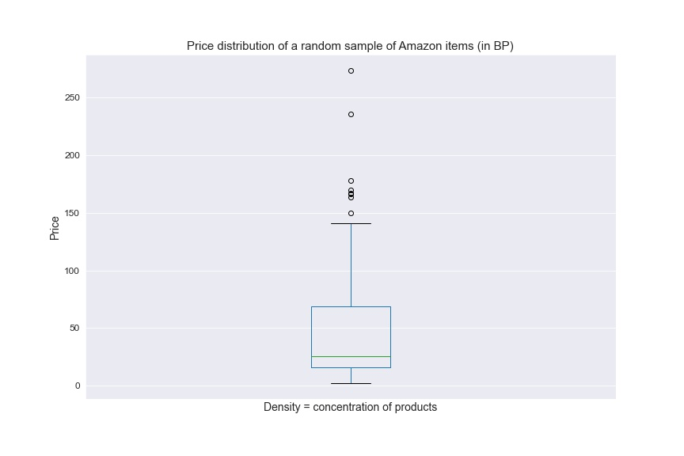
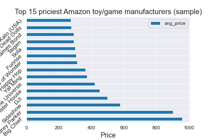
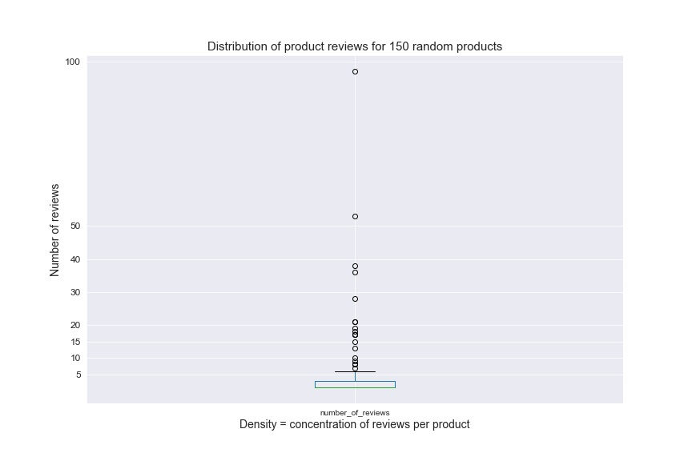
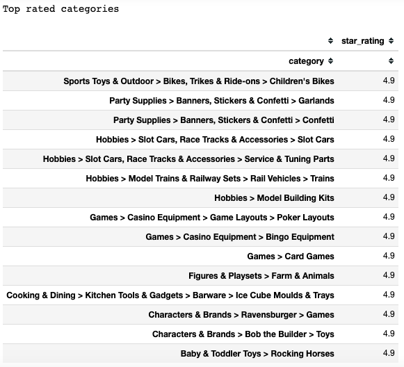
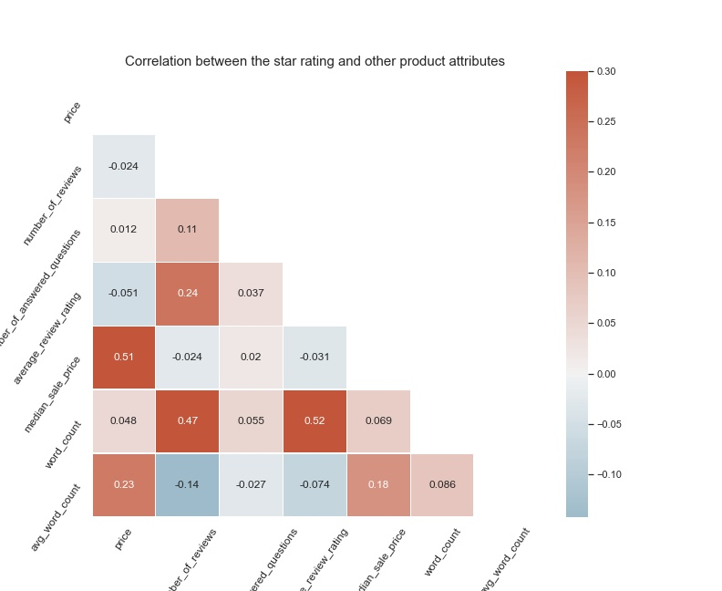
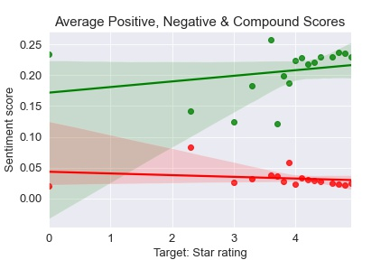

# Amazon product ratings predictor

- - - 

## Problem space and questions

Suppose that an Amazon executive wants to understand how a certain product or even its greater category are likely to be rated, such that the team can focus on appropriate strategies around poorly performing products (such as decisions around retaining certain sellers, among others). The exec wants to understand whether the way that certain products are described and language used in both reviews and customer questions has any bearing or correlation with the ubiquitous product star rating.

We are going to use a sample from the Amazon product catalog to understand the existence of any relationship between various product facets (such as price) and their impact on product ratings. Generally, we seek to understand whether there is a correlation between perceived product quality, based on the various facets, and the product's performance in terms of customer assessment (using ratings and reviews).

Some questions to be studied:

* Is there a correlation between the number of reviews and the number of customer questions?
* Is there a relationship between the number of sellers and the star rating?
* Is there a relationship between the star rating and the number of reviews?
* Is there any relationship between the product description and the star rating?
* Is there a relatioship between product price and rating?
* Is there a relationship between a product being sold as new vs. used and its rating?
* Do certain categories rank higher than others?
* Does sentiment correspond to a product's star rating?

- - -
## Data sources and acquisition

* Generic product catalog data obtained from [data.world](https://data.world/promptcloud/fashion-products-on-amazon-com).

- - -

## Cleaning, data wrangling and data engineering steps

Nulls were imputed and 0's in the target addressed.
Text was cleaned of strings including punctuation and dates, using string methods and price data parsed out of dictionaries.
Categorical data were encoded (dummified) for model input.

- - -
## Analysis & key findings

### Tooling

The `CountVectorizer` library is used to vectorize text and `Vader` for sentiment analysis.

### Observations and insights

From the basic descriptive stats, we can conclude the following:

* The average product price is 20 British pounds, while the most expensive item is north of 2K BP
* On average, a product listing has about 9 product reviews and 1-2 customer questions; yet many (50%-80%!) have no reviews or ratings at all, and customer questions are sparse.
* The average product rating is a mere 2 stars (*before handling 0's in the data)
* In the data, there are 7309 product listings with new items sold and 161 used
* There were 256 subcategories and 2646 manufacturers represented
* The average product review is 36 words

* Price concentration in Amazon product sample

* Priciest manufacturers (games and toys)

* Distribution of product reviews

* Top rated product categories 

* Trying to solve the holy grail: can we find patterns indicating any relationship with ratings? The correlations aren't very strong though, in the end:

* With sentiment analysis, we are able to _finally_ confirm a decent, promising linear relationship pattern between reviews and ratings -- our holy grail!

- - -
## NLP

Top bi-grams and tri-grams reveal promising signals about top concerns and frequently recurrent issues that come up in reviews.
Some of these include:

* year old
* quality
* parts
* _and many more

- - -
## ML

Since our target, average ratings, is continuous and known, we will use supervised regression modeling. We tried out the following:

* A Random Forest Regressor
* A regularized linear model
* A gradient boost regressor
* Support vector machine regressor

For our features set, we are using sentiment, our text, our categorized columns and all the numeric inputs including price.

Our hypothesis is that text may be a fairly weak predictor of the rating. However, we are hoping to come across some speficic negative and non-neutral words that can help us explain some of the lower side of the ratings.

We should also remember that not every product that's rated may necessarily come with a written review. Lastly, some products may not have any rating.

### Model evaluation

Given that we were initially dealing with some 0's or near 0's in the target (eventually addressed with imputation-like strategy), some metrics might not have worked as well as others (as an example, mean absolute percentage error was yielding infinites and was taken out of consideration).

The models were thus evaluated on following available regression metrics:

* `r2_score`
* `mean_absolute_error`
* `mean_squared_error`
* `mean_absolute_error`
* `mean_absolute_percentage_error`
* `explained_variance_score`
* `max_error`

Here are the results of evaluating each of our models.

1. Random Forest

* The R squared using the Random Forest model on our train data is 0.424 and on our test data is 1.0. (where proximity to 1 is ideal). _Concerns with leakage somewhere._
* The explained variance score, using the Random Forest model is 0.437 (where proximity to 1 is ideal).
* The max error on the Random Forest model is 1.95 stars (where proximity to 0 is ideal).
* The Root Mean Squared Error on our Random Forest model is 0.7289 (we want as close as possible to 0).
* The Mean Absolute Error on our Random Forest model is 0.69 stars, which is the swing we can expect in terms of attempting to generalize our model to unseen data.

As for feature importances, the story here is that we have just such an overwhelming number of features that each individual feature -- with the exception of the *number of reviews*, which turned out the most heavily weighted feature -- seems to get lost individually.

_________

2. Gradient booster regressor

* The best R-squared here was 0.5282 for training and 0.5025 for our test data. This is decent!

3. SVM regressor

* The best R-squared here was 0.8666 for training and 0.0543 for our test data.

The SVM regressor model performed the most poorly of the three, while Gradient Booster performed the most reliably, accounting for performance across both test and train. However, our Random Forest did the best on test, using the above metrics and is recommended for production, if we had to choose one.

- - - 

## Conclusions and recommendations

### Caveats, assumptions made and questions along the way

We approached a data set with the attempt to use text data to predict star ratings of an Amazon product.

In doing so, we ran into a few challenges with dimensionality. In addition, if we consider the complexity of the problem we've set out to solve, instinctively, predicting an exact numeric average for a product, down to decimal points, is exceedingly hard. In the future, we may try to re-frame the problem as a classification problem and attempt this exercise again on more vague and perhaps subjective targets, such as classifying a score as either "poor" (if it is below 3 out of 5 stars), "good or better" (if it's 4 stars or above) or "neutral".

In terms of data, we should mention a bit about potential bias as well. Because the sample was obtained from someone else's scraping results, we are a bit removed from the original source and cannot vouch for 100% accuracy of the data or the extraction methods.

One piece missing, for example, is the dates of the purchases (or direct purchase data) or of the reviews themselves; as a result, we are relying on extrapolating popularity from the number of reviews, without any idea of the freshness or recency of the data.

In addition, the original prices were in British pounds, so the data may be biased or skewed to a particular region; and the categories appear to may have been filtered down to only games and toy product related, which gives us at best a subset of customer purchases and, thus, possible insights.

Further, because no purchase data or product listing age information are available, rather than deducing sales, we can really only look at identifying general product popularity. We must be careful to account for nuances, such as the freshness of a product listing. We do, however, assume a near direct proportion between the number of reviews and a product's purchases; that is to say, each review _must_ come from a purchase (so there are at least that many) because of Amazon's product verification process (i.e., Amazon only allows customer reviews from validated purchases). Therefore, even our few outliers with 1,000+ ratings are presumed to be legitimate purchases.

Lastly, a word of caution must be noted on ratings overall. While the subject of scrutiny of papers beyond our scope, ratings are inherently subjective due to their design, and some customers may be confused about how to use them (e.g., think that 1 star is the best rating). We must ignore these kinds of nuances, without the ability here to do qualitative research to question the validity of each rating, but one way to get at this is to ensure, for example, that the sentiment -- e.g. a positive review -- actually corresponds with the rating, e.g. a positive rating (4 stars or better) in the case of a positive review, which we attempt to do with the sentiment analysis tools at our disposal.

- - -
## Report and presentation links

[`Slides`](https://docs.google.com/presentation/d/16-24og3wl4MC0OUlwuakeZuyuqF_WCxy1lFTB3g3K-8/edit?usp=sharing)

[`Data import, cleaning + EDA report`](./code/Amazon-product-catalog-cleaning-EDA.ipynb)

[`NLP + modeling report`](./code/Amazon-product-catalog-NLP-modeling.ipynb)

[`Recording`](https://drive.google.com/file/d/1gvHzDyGZtmbOvvEEFTXJbgvWqMyXfvIg/view?usp=drivesdk)

- - -
## References and contributors

The General Assembly instruction team for Data Science Immersive cohort DSIR-322 greatly contributed in consultation for this project. It includes Gwen Rathgeber, Charlie Rice, Heather Robbins and Devin Fay.
