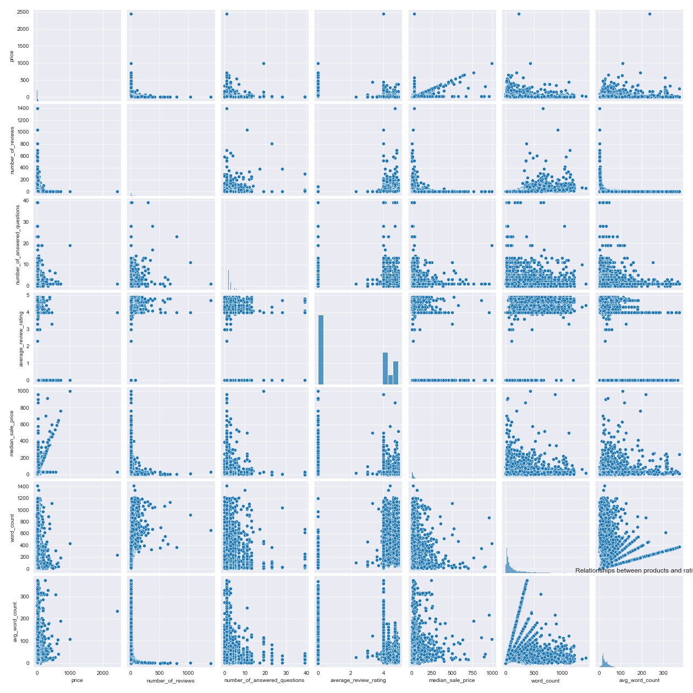
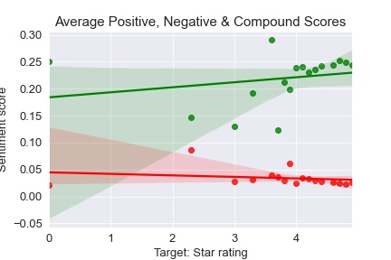

# Amazon product popularity predictor

- - - 

## Problem space and questions

We use a sample from the Amazon product catalog to understand the relationship between various factors and their impact on product ratings.

Generally, we seek to understand whether there is a correlation between product quality, as assessed by ratings and reviews, and the product popularity.

Some questions to be studied:

* Is there a correlation between the number of reviews and the number of customer questions?
* Is there a relationship between the number of sellers and the star rating?
* Is there a relationship between the star rating and the number of reviews?
* Is there any relationship between the product description and the star rating?
* Is there a relatioship between product price and rating?
* Is there a relationship between a product being sold as new vs. used and its rating?
* Do certain categories rank higher than others?
* Does sentiment correspond to a product's star rating?

- - -
## Data sources and acquisition

* Generic product catalog data obtained from [data.world](https://data.world/promptcloud/fashion-products-on-amazon-com).

- - -
## Analysis & key findings

### Tooling

The `CountVectorizer` library is used to vectorize text and `Vader` for sentiment analysis.

From the basic descriptive stats, we can conclude the following:

* The average product price is 20 British pounds, while the most expensive item is north of 2K
* Most products have about 9 product reviews and 1-2 customer questions
* The average product rating is a mere 2 stars
* In the data, there are 7309 product listings with new items sold and 161 used
* There were 256 subcategories and 2646 manufacturers represented

* Price concentration in Amazon product sample

* Priciest manufacturers (games and toys)

* Distribution of product reviews

* Top rated product categories 

* The holy grail: can we find patterns indicating any relationship with ratings?

* The correlations aren't very strong though, in the end:

* We _finally_ confirm a pretty good linear relationship pattern between reviews and ratings -- our holy grail!

- - -
## ML

Since our target, average ratings, is continous and known, we will use supervised regression modeling. We will try out Random Forest Regressor and a regularized linear model.

For our features set, we are using sentiment, our text, our categorized columns and all the numeric inputs including price.

Our hypothesis is that text may be a fairly weak predictor of the rating. However, we are hoping to come across some speficic negative and non-neutral words that can help us explain some of the lower side of the ratings.

We should also remember that not every product that's rated may necessarily come with a written review. Lastly, some products may not have any rating.

### Model evaluation

Given that we are dealing with some 0's or near 0's, some metrics will not work as well as others (as an example, mean absolute percentage error).

The models were thus evaluated on following available regression metrics:

* `r2_score`
* `mean_absolute_error`
* `mean_squared_error`
* `mean_absolute_error`
* `mean_absolute_percentage_error`
* `explained_variance_score`
* `max_error`

The ____ model performed the best, using the above metrics.

- - - 

## Conclusions and recommendations

### Caveats, assumptions made and questions along the way

Because the sample was obtained from someone else's scaping results, we are a bit removed from the original source and cannot vouch for 100% accuracy of the data or the extraction methods.

One piece missing, for example, is the dates of the purchases (or direct purchase data) or of the reviews themselves; as a result, we are relying on extrapolating popularity from the number of reviews, without any idea of the freshness or recency of the data.

In addition, the original prices were in British pounds, so the data may be biased or skewed to a particular region; and the categories appear to may have been filtered down to only games and toy product related, which gives us at best a subset of customer purchases and, thus, possible insights.

Further, because no purchase data or product listing age information are available, rather than deducing sales, we can really only look at identifying general product popularity. We must be careful to account for nuances, such as the freshness of a product listing. We do, however, assume a near direct proportion between the number of reviews and a product's purchases; that is to say, each review _must_ come from a purchase (so there are at least that many) because of Amazon's product verification process (i.e., Amazon only allows customer reviews from validated purchases). Therefore, even our few outliers with 1,000+ ratings are presumed to be legitimate purchases.

Lastly, a word of caution must be noted on ratings overall. While the subject of scrutiny of papers beyond our scope, ratings are inherently subjective due to their design, and some customers may be confused about how to use them (e.g., think that 1 star is the best rating). We must ignore these kinds of nuances, without the ability here to do qualitative research to question the validity of each rating, but one way to get at this is to ensure, for example, that the sentiment -- e.g. a positive review -- actually corresponds with the rating, e.g. a positive rating (4 stars or better) in the case of a positive review, which we attempt to do with the sentiment analysis tools at our disposal.

- - -
## Report and presentation links

[`Slides`](https://docs.google.com/presentation/d/16-24og3wl4MC0OUlwuakeZuyuqF_WCxy1lFTB3g3K-8/edit?usp=sharing)

[`Data import, cleaning + EDA report`](./code/Amazon-product-catalog-cleaning-EDA.ipynb)

[`NLP + modeling report`](./code/Amazon-product-catalog-NLP-modeling.ipynb)

- - -
## References and contributors

The General Assembly instruction team for Data Science Immersive cohort DSIR-322 greatly contributed in consultation for this project. It includes Gwen Rathgeber, Charlie Rice, Heather Robbins and Devin Fay.
